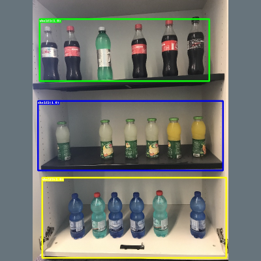
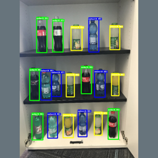

# Intelligent Retail
A 360 Intelligent Experiences workshop around using AI + Mobile Apps to deliver advance intelligent that help auditor and store managers to evaluate Retail market product stocking compliance

# Backround
<table>
    <tr>
        <td>
            
             
            
        </td>
        <td>

* **Contoso Market** has a huge distribution network of supermarket chains across over fourteen countries. Each of these distributors is required to arrange drinks on their stands according to standardized policies. Each policy describes what shelf a given drink should be on and in what order it should be stocked.​

* There are huge costs associated with "routine" audit activities to enforce these policies. **Contoso Market** wanted to develop a system in which an auditor or store manager could take a picture and be told immediately whether the shelf was stocked correctly, like in the image below.​
        </td>
    </tr>
</table>

# Invistigation

## AI Options for Object Classifications:
**During our scoping, we investigated a couple of approaches to image classification including:**
* Custom Vision Service
* Transfer Learning using CNTK ResNet 
* Object Detection with CNTK Fast-RCNN. 
## App Development
* Highly available Mobile Backend as a Service (MBaaS) 
* Apps that targets: iOS, Android and Windows
* Apps must be native to leverage 100% of device capabilities 
* Cost efficiency is key (for both development and maintenance)
## DevOps
* Establish Continuous Integration & Continuous Delivery for app delivery

# Implemenation

## Authors

|                  |                |                |
|:----------------------------------------------:|:--------------------------------------------:|:----------------------------------------------:|
|                 **Mohamed Saif**               |            **Petra Korica**                  |                 **Sherif El Mahdi**            |
|     [GitHub](https://github.com/mohamedsaif)   | [GitHub](https://github.com/)                |  [GitHub](https://github.com/SherifElMahdi)    |
|  [Twitter](https://twitter.com/mohamedsaif101) | [Twitter](https://twitter.com/robinmanuelt)  |        [Twitter](https://twitter.com/)         |
|         [Blog](http://blog.mohamedsaif.com)    |         [Blog](https://microsoft.com/)       |          [Blog](https://microsoft.com)         |

### Contributors

- **Ahmed Sabbour** ([GitHub](https://github.com/sabbour))
